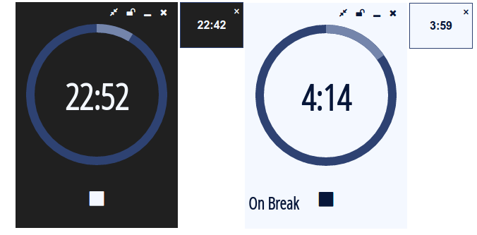

# Electric Tomato

A pomodoro timer built using Electron

To run it clone the repo, make sure that you have npm installed and then run once 
    
    npm install

and after that

    npm start

If you are interested in learning Electron read my [blog post about creating this project](http://www.blinkingcaret.com/2016/08/31/electron-is-amazing/). 

